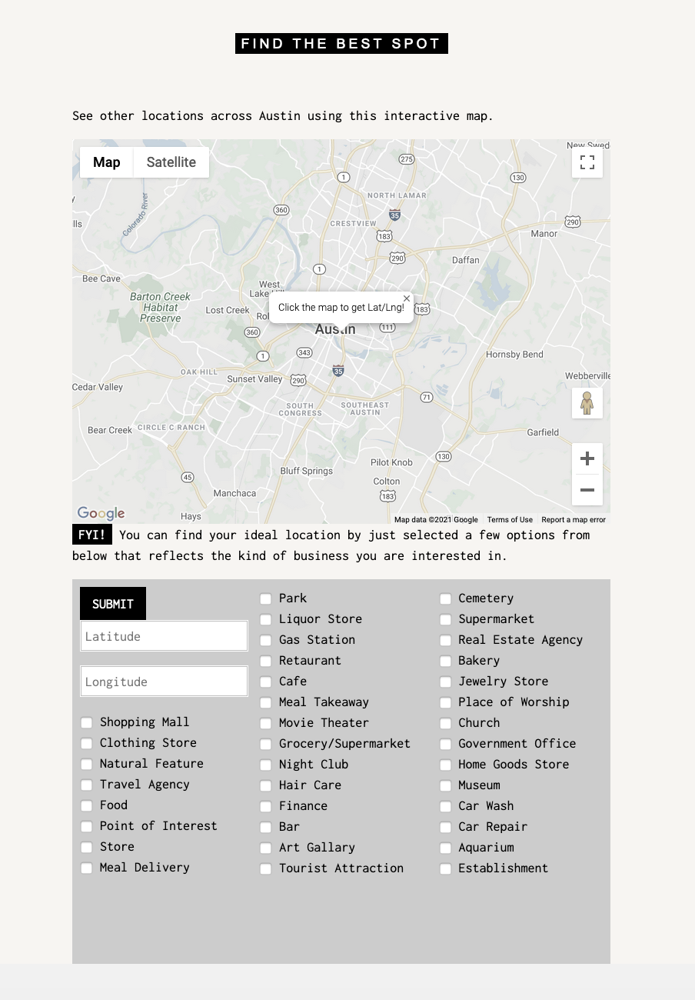

# Developing Austin with Machine Learning

### Deployed Project: 
https://develop-austin.herokuapp.com/

### Project Description
Our project focuses on users who are interested in developing new businesses and activites around Austin. Our app will use machine learning to predict a business rating based on the location and "types" of the new business.

On the "Prediction Route", users can use the interactive map to select a location in town to populate the longitude and latitude, then select the types that best describe their new business.



### Technologies and Packages:
* Python
* Pandas 
* JavaScript
* Scikit-learn
* Heroku (Cloud platform)
* Plotly
* Flask
* Jinja

### Machine Learning
We incorporated machine learning to develop a model to predict a rating after selecting specific attributes. 

Before creating the pipelines and testing different ML regressions, we had to clean out dataset and encode the data:

```python
df = pd.read_csv("../data/location3.csv").drop(columns =["id","types"], axis=1)

df

types_cols = [col for col in df.columns if col.startswith("type")]

df[types_cols] = df[types_cols].apply(lambda s: s.str.lstrip())

unique_values = set()

# for col in types_cols:
#     unique_values = unique_values.union(set(df["types1"].values))

for col in types_cols:
    unique_values = unique_values.union(set(df[col].values))
    
df["types"] = df[types_cols].apply(lambda row: set(row), axis=1)

boolean_features = {}

for category in unique_values:
    boolean_features[category] = df["types"].apply(lambda s: category in s)
    
boolean_df = pd.DataFrame(boolean_features)

boolean_df

df = pd.concat([df, boolean_df], axis=1).drop([*types_cols, "types"], axis=1)
```
After encoding, we had to create the train test split:

```python
X = df.drop(
     columns=[
        "rating",
        "latitude_region",
        "user_ratings_total",
    ],
    axis=1,
).values
y = df[target].values

X_train, X_test, y_train, y_test = train_test_split(X, y, random_state=20)
```

We tested Linear Regression, Random Forrest and Decision Tree, and found Linear Regression gave the best results for our data set:

```python

linear_regression = LinearRegression()
linear_regression.fit(X_train, y_train)
y_test_pred = linear_regression.predict(X_test)
mean_squared_error(y_test, y_test_pred)
```

Created a pipeline and cross validated the pipeline, then fit the pipeline:

```python
lr_pipeline = make_pipeline(LinearRegression())
k_fold = KFold(n_splits=6, shuffle=True, random_state=45)
cross_validate(lr_pipeline, X, y, scoring="neg_mean_squared_error", cv=k_fold)[
    "test_score"
].mean()

lr_pipeline.fit(X,y)
dump(lr_pipeline, "lr.joblib")
```

### Team Members

- [Akik Patel](https://github.com/akikp "GitHub"): Frontend Developer
- [Caroline Moeser ](https://github.com/cmoeser5 "Github"): Lead Developer, Backend Developer
- [Ed Yancik](https://github.com/Yanwho "GitHub"): Frontend Developer
- [Natalia Saavedra](https://github.com/atxnatalia "GitHub"): Frontend Developer
- [Zach Childers](https://github.com/zlinguist "GitHub"): Backend Developer, Project Manager 